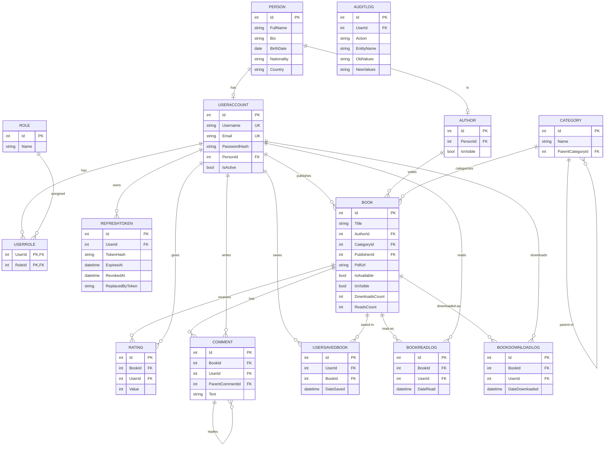

# Data Model & ERD
## Digital Book Library API

This document describes the entities, their relationships, and the Entity-Relationship Diagram.
It reflects the **provided entities** plus one required addition: `RefreshToken`.

---

## 1. Entity Overview

| Entity | Purpose | Key relationships |
|--------|---------|-------------------|
| `Person` | Real person data (name, bio, nationality...). | 1–1 with `UserAccount`, 1–1 with `Author`. |
| `UserAccount` | Login account (username, email, `PasswordHash`, `IsActive`). | → `Person`, ⋈ `Role` via `UserRole`, publishes `Book`s. |
| `Role` | Authorization role (`Admin`, `Member`). | ⋈ `UserAccount` via `UserRole`. |
| `UserRole` | Join table (many-to-many user↔role). | composite (`UserId`,`RoleId`). |
| `RefreshToken` **(new)** | Persisted refresh tokens for JWT rotation. | many → `UserAccount`. |
| `Author` | An authoring identity, backed by a `Person`. | 1 → `Person`, 1–many `Book`. |
| `Category` | Book category, **self-referencing tree**. | parent/children self ref, 1–many `Book`. |
| `Book` | Catalog item (metadata + file refs + counters). `DateCreated` = when it was added to the library, distinct from `PublishDate` = when the book itself was published. | → `Author`, → `Category`, → `UserAccount` (publisher), 1–many `Rating`/`Comment`. |
| `Rating` | 1–5 rating of a book by a user. | → `Book`, → `UserAccount`. |
| `Comment` | Threaded comment on a book. | → `Book`, → `UserAccount`, self ref (replies). |
| `UserSavedBook` | Favorites / wishlist join. | → `UserAccount`, → `Book`. |
| `BookReadLog` | One read event. | → `Book`, → `UserAccount`. |
| `BookDownloadLog` | One download event. | → `Book`, → `UserAccount`. |
| `AuditLog` | Generic audit trail of sensitive mutations. | optional → `UserAccount` (`UserId?`). |

---

## 2. Relationships (cardinality)

- `Person (1) —— (0..1) UserAccount` — a person may have a login account.
- `Person (1) —— (0..1) Author` — a person may be an author.
- `UserAccount (M) —— (M) Role` — through `UserRole`.
- `UserAccount (1) —— (M) RefreshToken`.
- `UserAccount (1) —— (M) Book` — as **publisher** (`Book.PublisherId`, optional).
- `Author (1) —— (M) Book`.
- `Category (0..1 parent) —— (M children) Category` — tree.
- `Category (1) —— (M) Book`.
- `Book (1) —— (M) Rating`, `Book (1) —— (M) Comment`.
- `Comment (0..1 parent) —— (M replies) Comment` — thread.
- `UserAccount (M) —— (M) Book` — through `UserSavedBook` (saved list).
- `Book (1) —— (M) BookReadLog / BookDownloadLog`.

> **Authors with vs. without accounts** — the `Person → UserAccount` link is **optional (0..1)**:
> - A classic/historical author = an `Author` whose `Person` has **no** `UserAccount`. Catalog data only; cannot log in.
> - A living author with an account = the same `Person` also has a `UserAccount`. That user acts as **Publisher**
>   (`Book.PublisherId`) and can upload/manage their own books.
> - `Book.AuthorId` (required) = who wrote the book; `Book.PublisherId` (nullable) = the account that uploaded it.
>   A book by a classic author simply has `PublisherId = null` (added by an Admin).

> **Uniqueness rules (to enforce via indexes/config):**
> - `UserAccount.Email` unique, `UserAccount.Username` unique.
> - `Rating (UserId, BookId)` unique — one rating per user per book (FR-RATE-2).
> - `UserSavedBook (UserId, BookId)` unique — no duplicate saves (FR-SAVE-4).
> - `UserRole (UserId, RoleId)` composite primary key.

---

## 3. ERD (Mermaid)



---

## 4. Required New Entity: `RefreshToken`

Needed to satisfy FR-AUTH-3/4 (refresh + revoke). Tokens are stored **hashed** and rotated.

```csharp
namespace DigitalBookLibrary.Domain.Entities
{
    public class RefreshToken
    {
        public int Id { get; set; }
        public int UserId { get; set; }
        public string TokenHash { get; set; } = string.Empty;   // never store the raw token
        public DateTime ExpiresAt { get; set; }
        public DateTime CreatedAt { get; set; } = DateTime.UtcNow;
        public DateTime? RevokedAt { get; set; }
        public string? ReplacedByToken { get; set; }            // rotation chain
        public string? CreatedByIp { get; set; }

        public bool IsActive => RevokedAt is null && DateTime.UtcNow < ExpiresAt;
        public UserAccount? User { get; set; }
    }
}
```

---

## 5. EF Core Configuration Notes
- Configure entities via `IEntityTypeConfiguration<T>` classes in `Infrastructure/Persistence/Configurations/`.
- `Book.IsAvailable`, `IsVisible`, `DownloadsCount`, `ReadsCount` have **private setters** → EF Core maps them
  via its property access; the domain methods (`IncrementDownloads`, etc.) remain the only way to mutate them in code.
- `UserRole`: composite key `HasKey(x => new { x.UserId, x.RoleId })`.
- `Category` and `Comment` self references: `OnDelete(DeleteBehavior.Restrict)` to avoid multiple cascade paths.
- Unique indexes: `Email`, `Username`, `(UserId,BookId)` on `Rating` and `UserSavedBook`.
- `decimal FileSizeMb` → `HasPrecision(9,2)`.
- Seed `Role` rows (`Admin`, `Member`) and one admin account in `OnModelCreating` or a seeder.
