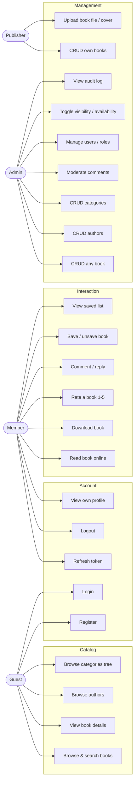

# Use Case Diagram
## Digital Book Library API

Actors and the use cases they can perform. Mermaid `flowchart` is used to approximate a UML use-case view
(GitHub does not render UML use-case natively).

---

## 1. Actors & Goals

| Actor | Primary goals |
|-------|---------------|
| **Guest** | Discover content: browse/search books, authors, categories; view details & ratings. |
| **Member** | Everything a Guest can, plus: read/download, comment, rate, save books, manage profile. |
| **Publisher** | A Member who additionally manages **their own** books. |
| **Admin** | Full content & user management + moderation + audit. |

> Member inherits Guest capabilities; Publisher inherits Member; Admin inherits all.

---

## 2. Use Case Diagram (Mermaid)

---

## 3. Representative Use Case: "Member rates a book"

| Field | Value |
|-------|-------|
| **Actor** | Member |
| **Precondition** | Authenticated; book exists and is visible. |
| **Main flow** | 1. Member submits rating value (1–5) for a book. 2. System validates range. 3. If the user already rated → update; else create. 4. Persist via UoW. 5. Return updated average. |
| **Alternate** | Value outside 1–5 → `RATING_OUT_OF_RANGE` (400). Book not found → `BOOK_NOT_FOUND` (404). |
| **Postcondition** | Exactly one rating row for `(user, book)`; average reflects it. |
| **Maps to** | FR-RATE-1, FR-RATE-2, FR-RATE-3. |

## 4. Representative Use Case: "Member downloads a book"

| Field | Value |
|-------|-------|
| **Actor** | Member |
| **Precondition** | Authenticated; book exists, is available, has a PDF file. |
| **Main flow** | 1. Request download. 2. System checks availability (`Book.IncrementDownloads` enforces it). 3. Increment `DownloadsCount` + write `BookDownloadLog` in one UoW transaction. 4. Stream the file. |
| **Alternate** | Not available → `BOOK_NOT_AVAILABLE` (409). No file → `BOOK_FILE_MISSING` (404). |
| **Postcondition** | Download counter +1; one log row added. |
| **Maps to** | FR-ACT-2, FR-ACT-3, FR-ACT-4. |
