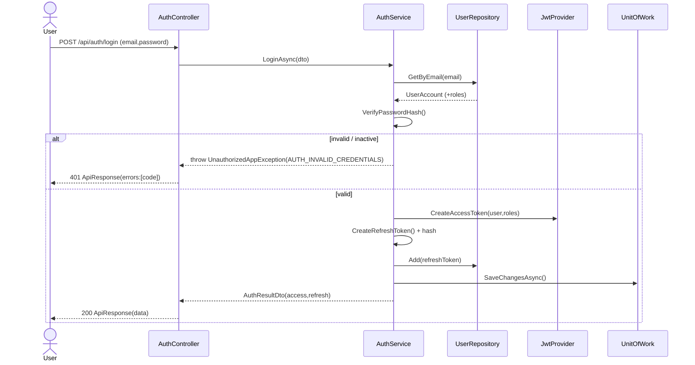
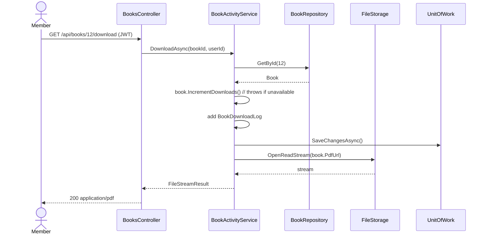

# API Contract
## Digital Book Library API

REST endpoints grouped by module. **Every** response is wrapped in `ApiResponse<T>`.
Auth column: 🔓 public · 🔑 authenticated · 👑 Admin · ✍️ owner/Publisher.

Base path: `/api`

---

## 1. Auth  (`/api/auth`) — `AuthService`
| Method | Route | Auth | Body → Result | Maps to |
|--------|-------|------|---------------|---------|
| POST | `/register` | 🔓 | `RegisterDto` → `UserDto` | FR-AUTH-1 |
| POST | `/login` | 🔓 | `LoginDto` → `AuthResultDto` (access+refresh) | FR-AUTH-2 |
| POST | `/refresh` | 🔓* | `RefreshDto` → `AuthResultDto` | FR-AUTH-3 |
| POST | `/logout` | 🔑 | `RefreshDto` → `-` | FR-AUTH-4 |
| GET  | `/me` | 🔑 | → `UserProfileDto` | FR-AUTH-5 |

\* `/refresh` accepts an expired access token but a valid refresh token.

## 2. Books  (`/api/books`) — `BookService`
| Method | Route | Auth | Notes | Maps to |
|--------|-------|------|-------|---------|
| GET | `/` | 🔓 | `BookQueryParams` → `PagedResult<BookListDto>` (page/filter/sort/search) | FR-BOOK-1, FR-BOOK-3 |
| GET | `/{id}` | 🔓 | → `BookDetailsDto` (author, category, avg rating) | FR-BOOK-2 |
| POST | `/` | 👑✍️ | `CreateBookDto` → `BookDto` | FR-BOOK-4 |
| PUT | `/{id}` | 👑✍️ | `UpdateBookDto` → `BookDto` | FR-BOOK-4 |
| DELETE | `/{id}` | 👑 | → `-` | FR-BOOK-4 |
| POST | `/{id}/file` | 👑✍️ | multipart PDF → `{ pdfUrl }` | FR-BOOK-5 |
| POST | `/{id}/cover` | 👑✍️ | multipart image → `{ imageUrl }` | FR-BOOK-5 |
| PATCH | `/{id}/visibility` | 👑 | `{ isVisible }` | FR-BOOK-6 |
| PATCH | `/{id}/availability` | 👑 | `{ isAvailable }` | FR-BOOK-6 |

## 3. Book Activity  (`/api/books/{id}`) — `BookActivityService`
| Method | Route | Auth | Notes | Maps to |
|--------|-------|------|-------|---------|
| GET | `/read` | 🔑 | streams file, logs read, +ReadsCount | FR-ACT-1 |
| GET | `/download` | 🔑 | serves file, logs download, +DownloadsCount (blocked if unavailable) | FR-ACT-2,3 |

### 3.1 My Library  (`/api/me`) — `BookActivityService` + `SavedBookService`
The member's personal library — three tabs. All paginated, most-recent first, own data only.
| Method | Route | Auth | Notes | Maps to |
|--------|-------|------|-------|---------|
| GET | `/me/read-books` | 🔑 | books the member has read (distinct, latest date) | FR-ACT-5 |
| GET | `/me/downloaded-books` | 🔑 | books the member has downloaded (distinct, latest date) | FR-ACT-6 |
| GET | `/me/saved-books` | 🔑 | alias of `/api/saved-books` (§8) — the saved tab | FR-SAVE-3 |

## 4. Authors  (`/api/authors`) — `AuthorService`
| Method | Route | Auth | Notes |
|--------|-------|------|-------|
| GET | `/` | 🔓 | `PagedResult<AuthorListDto>` (search) |
| GET | `/{id}` | 🔓 | `AuthorDetailsDto` + books |
| POST | `/` | 👑 | `CreateAuthorDto` |
| PUT | `/{id}` | 👑 | `UpdateAuthorDto` |
| DELETE | `/{id}` | 👑 | — |

## 5. Categories  (`/api/categories`) — `CategoryService`
| Method | Route | Auth | Notes |
|--------|-------|------|-------|
| GET | `/` | 🔓 | tree of `CategoryDto` |
| GET | `/{id}` | 🔓 | category + books |
| POST | `/` | 👑 | `CreateCategoryDto` |
| PUT | `/{id}` | 👑 | `UpdateCategoryDto` |
| DELETE | `/{id}` | 👑 | blocked if has books/children |

## 6. Comments  (`/api/books/{bookId}/comments`) — `CommentService`
| Method | Route | Auth | Notes |
|--------|-------|------|-------|
| GET | `/` | 🔓 | threaded `CommentDto` list |
| POST | `/` | 🔑 | `CreateCommentDto` (optional `parentCommentId`) |
| PUT | `/{commentId}` | ✍️ | edit own |
| DELETE | `/{commentId}` | ✍️👑 | own or admin |

## 7. Ratings  (`/api/books/{bookId}/rating`) — `RatingService`
| Method | Route | Auth | Notes |
|--------|-------|------|-------|
| PUT | `/` | 🔑 | `{ value:1..5 }` upsert (one per user/book) |
| GET | `/summary` | 🔓 | `{ average, count }` |
| DELETE | `/` | 🔑 | remove own rating |

## 8. Saved Books  (`/api/saved-books`) — `SavedBookService`
| Method | Route | Auth | Notes |
|--------|-------|------|-------|
| GET | `/` | 🔑 | `PagedResult<BookListDto>` of own saved |
| POST | `/{bookId}` | 🔑 | save (idempotent) |
| DELETE | `/{bookId}` | 🔑 | unsave |

## 8b. Admin Dashboard  (`/api/admin/dashboard`) — `DashboardService`  👑 all Admin-only
| Method | Route | Notes | Maps to |
|--------|-------|-------|---------|
| GET | `/summary` | KPI card totals: books, users, authors, categories, downloads, reads | FR-DASH-1 |
| GET | `/top-books?metric=downloads\|reads\|rating&take=10` | top-N books by metric | FR-DASH-2 |
| GET | `/recent?type=users\|books\|comments&take=10` | recent activity feed | FR-DASH-3 |
| GET | `/activity-series?from=&to=&interval=day\|month` | downloads/reads time series (charts) | FR-DASH-4 |
| GET | `/distribution?by=category\|language` | books distribution (charts) | FR-DASH-5 |

### 8c. Admin User Management  (`/api/admin/users`) — `DashboardService`/`AuthService`  👑
| Method | Route | Notes | Maps to |
|--------|-------|-------|---------|
| GET | `/` | `PagedResult<AdminUserDto>` (search, `isActive` filter, roles) | FR-DASH-6 |
| PATCH | `/{id}/active` | activate/deactivate an account | FR-DASH-6 |
| PATCH | `/{id}/roles` | assign/remove roles | FR-DASH-6 |
| GET | `/audit` | `PagedResult<AuditLogDto>` (filter by entity/action) | FR-DASH-7 |

---

## 9. Standard HTTP status mapping
| Situation | Status | `ApiResponse` |
|-----------|--------|---------------|
| Success (GET/PUT/PATCH) | 200 | `Success=true` |
| Created | 201 | `Success=true` |
| Validation error | 400 | codes of failed rules |
| Unauthenticated | 401 | `AUTH_INVALID_CREDENTIALS` / `AUTH_TOKEN_INVALID` |
| Forbidden (role/ownership) | 403 | `FORBIDDEN` |
| Not found | 404 | `<X>_NOT_FOUND` |
| Conflict / rule violation | 409 | e.g. `BOOK_NOT_AVAILABLE` |
| Unhandled | 500 | `INTERNAL_SERVER_ERROR` |

---

## 10. Sequence — Login + issue tokens

## 11. Sequence — Download a book

